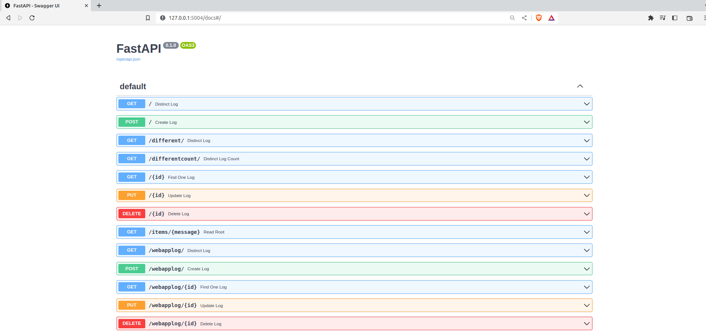

# TÜRKÇE DÖKÜMAN

## Proje nasıl çalıştırılır

komut satırına sırayla aşağıdaki satırları yazmanız yeterlidir
 
<code>
-sudo docker-compose build  
-sudo docker-compose up 

</code>

## Dökümana nasıl erişirim

Projeyi çalıştırdıktan sonra tarayıcya  "127.0.0.1:5004/docs" yazmanız yeterli olacaktır

## Veritabanına nasıl erişirim

Projeyi çalıştırdıktan sonra   <code>sudo docker exec -it mongodb bash</code>

 
Ardından komut satırına  
<code>
mongosh --host localhost --port 27017 -u admin -p password --authenticationDatabase admin</code>
  
Yeterlidir

# ENGLİSH DOCS

## how to run this project

sudo docker-compose build
sudo docker-compose up 

## how to open docs 

type on the browser :127.0.0.1:5004/docs

enjoy your service :)

## how to reach mongodb
sudo docker exec -it mongodb bash

mongosh --host localhost --port 27017 -u admin -p password --authenticationDatabase admin